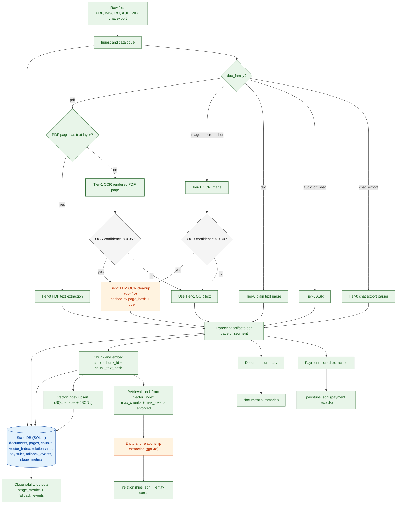
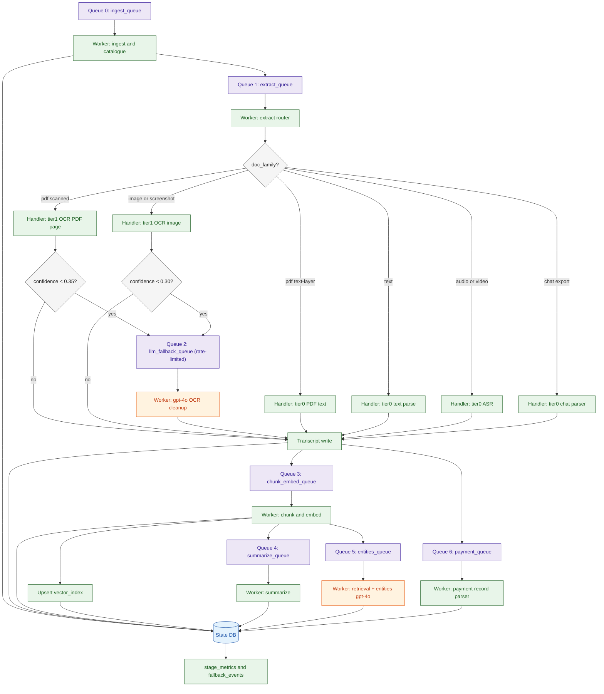

# agentic-parse

Scalable multimodal document ETL where deterministic parsing does first-pass extraction and `gpt-4o` is used for constrained downstream reasoning.

## Current implementation

- Immutable ingest with `sha256` -> stable `document_id` and dedupe.
- Catalogue-first pass without OCR/ASR/LLM dependency.
- Tiered extraction:
  - Text-layer PDFs: deterministic parse (`pypdf`).
  - Scanned images/PDF pages: deterministic OCR first (`pytesseract`, `pypdfium2`).
  - Controlled LLM fallback only when needed, with audit trail.
  - Audio/video: ASR-first path with timestamp provenance (placeholder fallback if ASR unavailable).
  - Chat exports: deterministic parser.
- Stable chunking + embedding lifecycle (`chunk_text_hash`, embedding model/version) + vector index table.
- Retrieval-first query extraction with hard limits (`top_k`, `max_chunks`, `max_tokens`).
- Payment-record extraction (receipts/invoices/payment sheets; pay-stub fields optional) with deterministic currency parsing and conditional consistency checks.
- Incremental entity/relationship extraction with page/timestamp evidence pointers.
- Idempotent pipeline behavior, atomic artifact writes, and stage/fallback metrics.

## Architecture diagram



## Queue orchestration diagram



## Repository layout

- `src/agentic_parse/cli.py`: CLI entrypoint and stage orchestration.
- `src/agentic_parse/db.py`: schema + migration-safe initialization.
- `src/agentic_parse/ingest.py`: hashing, dedupe, catalogue rows.
- `src/agentic_parse/extract_text.py`: OCR/ASR/transcript pipeline.
- `src/agentic_parse/chunk_embed.py`: chunking, embedding lifecycle, retrieval helper.
- `src/agentic_parse/entities.py`: entity/relationship extraction + retrieval-first query mode.
- `src/agentic_parse/paystub.py`: payment-record parsing/validation.
- `src/agentic_parse/summarize.py`: transcript-first summaries.
- `src/agentic_parse/llm.py`: OpenAI client wrapper + caching.
- `src/agentic_parse/telemetry.py`: metrics and fallback audit logging.

## Data model highlights

- `document_id = doc_<sha256_prefix>`
- `page_id = <document_id>_p<page_number>`
- `chunk_id = <page_id>_c<chunk_index>`

Core tables:

- `documents`: media metadata, durations, lifecycle statuses.
- `pages`: source tier/pointer, OCR confidence, timestamps, fallback metadata.
- `chunks`: text span metadata + embedding hash/model/version.
- `vector_index`: vector records by chunk.
- `relationships`: evidence-backed edges with page/timestamp pointers.
- `paystubs`: generalized payment records + validation status.
- `fallback_events`: auditable fallback triggers and model/version references.
- `stage_metrics`: processed/skipped/failed/token usage.

## Quick start

```bash
export OPENAI_API_KEY="<your-key>"   # optional but recommended
export OPENAI_MODEL="gpt-4o"          # default is gpt-4o

python -m agentic_parse.cli --workspace ./workspace --raw-root ./raw all --workers 4
python -m agentic_parse.cli --workspace ./workspace --raw-root ./raw status
```

## Stage commands

```bash
python -m agentic_parse.cli --workspace ./workspace --raw-root ./raw ingest
python -m agentic_parse.cli --workspace ./workspace --raw-root ./raw extract-text --workers 8
python -m agentic_parse.cli --workspace ./workspace --raw-root ./raw chunk
python -m agentic_parse.cli --workspace ./workspace --raw-root ./raw summarize
python -m agentic_parse.cli --workspace ./workspace --raw-root ./raw entities
python -m agentic_parse.cli --workspace ./workspace --raw-root ./raw paystubs
python -m agentic_parse.cli --workspace ./workspace --raw-root ./raw extract-query --query "Who appears with Acme?" --top-k 8 --max-chunks 20 --max-tokens 6000
python -m agentic_parse.cli --workspace ./workspace --raw-root ./raw status
```

## Outputs

- `workspace/outputs/document_catalogue.jsonl`
- `workspace/outputs/relationships.jsonl`
- `workspace/outputs/paystubs.jsonl`
- `workspace/outputs/fallback_events.jsonl`
- `workspace/outputs/stage_metrics.jsonl`
- `workspace/outputs/vector_index.jsonl`
- `workspace/outputs/entities/ent_*.json`

## Optional dependencies

- `openai`: `gpt-4o` reasoning + ASR.
- `pypdf`: text-layer PDF extraction.
- `pytesseract` + `Pillow`: OCR.
- `pypdfium2`: PDF page rendering for OCR.
- `ffprobe` (system): media duration probing.

## Tests

```bash
pytest
```
