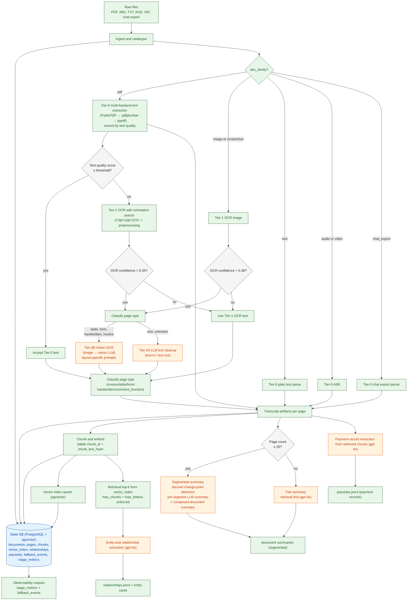
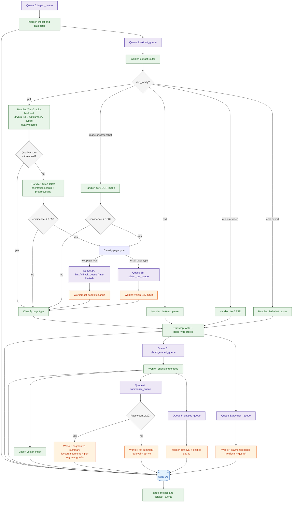

# agentic-parse

Scalable multimodal document ETL where deterministic parsing does first-pass extraction and `gpt-4o` is used for constrained downstream reasoning.

## Current implementation

- Immutable ingest with `sha256` → stable `document_id` and dedupe.
- Catalogue-first pass without OCR/ASR/LLM dependency. Catalogue JSONL is refreshed from DB state after each summarize run so statuses stay current.
- Tiered extraction with quality-gated escalation:
  - **Tier-0 (multi-backend)**: PyMuPDF → pdfplumber → pypdf per page; best candidate selected by text quality score.
  - **Text quality scoring**: 6-signal composite (alpha ratio, printable ratio, unique-char ratio, short-line ratio, whitespace dominance, word density). Pages below the quality threshold escalate even when text is present — catches garbled extractions, vertical text, and near-empty pages.
  - **Tier-1 OCR**: tesseract with 4-rotation search (0°/90°/180°/270°) + grayscale/sharpen preprocessing; best-confidence orientation used for final extraction.
  - **Tier-2A (LLM text cleanup)**: text-in/text-out cleanup for noisy OCR on text-dominant pages.
  - **Tier-2B (Vision OCR)**: rendered page image sent to a vision-capable LLM for faithful transcription; used for visually complex page types (tables, forms, handwriting, invoices). Layout-specific prompts per page type.
  - Audio/video: ASR-first path with timestamp provenance (placeholder fallback if ASR unavailable).
  - Chat exports: deterministic parser.
- **Page-type classification**: deterministic heuristics classify every page as one of `invoice`, `table`, `form`, `handwritten`, `comment_box`, `text`, or `blank`. Stored in the `pages` table; drives Tier-2A/2B routing and segment labels in summaries.
- **Long PDF segmentation**: documents ≥ 20 pages are split into thematic segments via adjacent-page Jaccard similarity change-point detection. Each segment is summarized independently, then a composed document summary includes a section index with page ranges and dominant page types.
- Stable chunking + embedding lifecycle (`chunk_text_hash`, embedding model/version) + vector index table. Documents with all-empty pages (unreadable scans) are marked `status_embed = done` without blocking downstream stages.
- Retrieval-first query extraction with hard limits (`top_k`, `max_chunks`, `max_tokens`).
- Payment-record extraction (receipts/invoices/payment sheets; pay-stub fields optional) via retrieval-first `gpt-4o` extraction with validator checks.
- Incremental entity/relationship extraction with page/timestamp evidence pointers.
- Idempotent pipeline behavior, atomic artifact writes, and stage/fallback metrics.

## Architecture diagram



## Queue orchestration diagram



## Repository layout

- `src/agentic_parse/cli.py`: CLI entrypoint and stage orchestration.
- `src/agentic_parse/db.py`: schema + migration-safe initialization (including `page_type` column).
- `src/agentic_parse/ingest.py`: hashing, dedupe, catalogue rows.
- `src/agentic_parse/extract_text.py`: tiered OCR/ASR/transcript pipeline — quality scoring, multi-backend Tier-0, orientation-aware Tier-1, Tier-2A/2B routing, page-type classification.
- `src/agentic_parse/chunk_embed.py`: chunking, embedding lifecycle, retrieval helper.
- `src/agentic_parse/entities.py`: entity/relationship extraction + retrieval-first query mode.
- `src/agentic_parse/paystub.py`: embedding-retrieved LLM payment-record extraction + validation.
- `src/agentic_parse/summarize.py`: flat and segmented LLM document summaries; catalogue JSONL refresh.
- `src/agentic_parse/llm.py`: OpenAI client wrapper + caching.
- `src/agentic_parse/telemetry.py`: metrics and fallback audit logging.

## Data model highlights

- `document_id = doc_<sha256_prefix>`
- `page_id = <document_id>_p<page_number>`
- `chunk_id = <page_id>_c<chunk_index>`

Core tables:

- `documents`: media metadata, durations, lifecycle statuses.
- `pages`: source tier/pointer, OCR confidence, timestamps, fallback metadata, **`page_type`** label.
- `chunks`: text span metadata + embedding hash/model/version.
- `vector_index`: pgvector records by chunk (HNSW index).
- `relationships`: evidence-backed edges with page/timestamp pointers.
- `paystubs`: generalized payment records + validation status.
- `fallback_events`: auditable fallback triggers (including `bad_text_layer`, `vertical_or_fragmented_text`, `empty_or_near_empty`) and model/version references.
- `stage_metrics`: processed/skipped/failed/token usage per stage run.

## Text extraction tiers

| Tier | Method | Trigger |
|------|--------|---------|
| 0A | PyMuPDF (`fitz`) | Always tried first |
| 0B | pdfplumber | Tried alongside 0A; best quality wins |
| 0C | pypdf | Tried alongside 0A/0B; best quality wins |
| 1 | tesseract OCR (4 rotations + preprocessing) | Tier-0 quality score below threshold |
| 2A | LLM text cleanup (gpt-4o) | Tier-1 confidence < 0.35, text/unknown page type |
| 2B | Vision OCR (gpt-4o vision) | Tier-1 confidence < 0.35, visual page type (table/form/handwritten/invoice) |

## Page types

Pages are classified after extraction and stored in the `pages` table:

| Type | Detection signals |
|------|------------------|
| `invoice` | ≥2 of: invoice, receipt, bill to, ship to, subtotal, total due, tax, amount due |
| `table` | >30% of lines with ≥3 numeric tokens, or >40% with ≥2 whitespace-aligned columns |
| `form` | ≥2 checkbox characters or ≥3 form field labels (name/date/signature/address/etc.) |
| `handwritten` | Tier-1 confidence < 0.35 + >50% short tokens |
| `comment_box` | Keywords: comment, response, author, reply, reviewed by |
| `text` | Default for clean text content |
| `blank` | Empty content |

## Quick start

```bash
export OPENAI_API_KEY="<your-key>"
export OPENAI_MODEL="gpt-4o"          # default is gpt-4o-mini

python -m agentic_parse.cli --workspace ./workspace --raw-root ./raw all --workers 4
python -m agentic_parse.cli --workspace ./workspace --raw-root ./raw status
```

## Stage commands

```bash
python -m agentic_parse.cli --workspace ./workspace --raw-root ./raw ingest
python -m agentic_parse.cli --workspace ./workspace --raw-root ./raw extract-text --workers 8
python -m agentic_parse.cli --workspace ./workspace --raw-root ./raw chunk
python -m agentic_parse.cli --workspace ./workspace --raw-root ./raw summarize
python -m agentic_parse.cli --workspace ./workspace --raw-root ./raw entities
python -m agentic_parse.cli --workspace ./workspace --raw-root ./raw paystubs
python -m agentic_parse.cli --workspace ./workspace --raw-root ./raw extract-query --query "Who appears with Acme?" --top-k 8 --max-chunks 20 --max-tokens 6000
python -m agentic_parse.cli --workspace ./workspace --raw-root ./raw status
```

## Outputs

- `workspace/outputs/document_catalogue.jsonl` — refreshed after each summarize run
- `workspace/outputs/document_summary_catalogue.json` — grouped catalogue generated from short document summaries
- `workspace/outputs/relationships.jsonl`
- `workspace/outputs/paystubs.jsonl`
- `workspace/outputs/fallback_events.jsonl`
- `workspace/outputs/stage_metrics.jsonl`
- `workspace/outputs/vector_index.jsonl`
- `workspace/outputs/entities/ent_*.json`
- `workspace/derived/summaries/<doc_id>/document.summary.txt` — flat or segmented

## Dependencies

Required:

- `psycopg2-binary` + PostgreSQL with `pgvector` extension
- `openai`: gpt-4o reasoning, vision OCR (Tier-2B), and ASR

Optional (gracefully degraded if absent):

- `pymupdf` (`fitz`): best-quality Tier-0 PDF text extraction
- `pdfplumber`: table-aware Tier-0 extraction
- `pypdf`: fast Tier-0 fallback (always included)
- `pytesseract` + `Pillow`: Tier-1 OCR
- `pypdfium2`: PDF page rendering for Tier-1 OCR
- `ffprobe` (system): media duration probing

## Tests

```bash
pytest
```
